# Hello_Proto
"Banner Grabbing" en entornos industriales. 

### Bacnet
## Uso / usage

	usr@pwn:~$ python hello_bacnet.py <bacnet device> 

## poc	
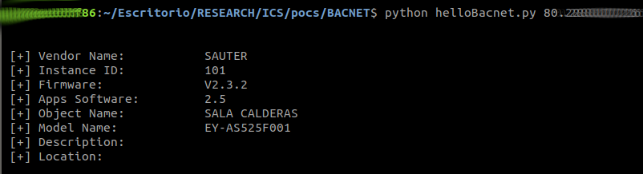
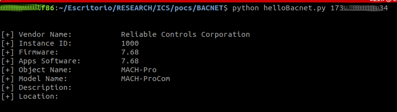
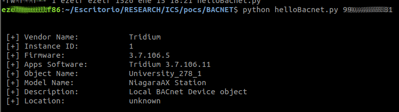
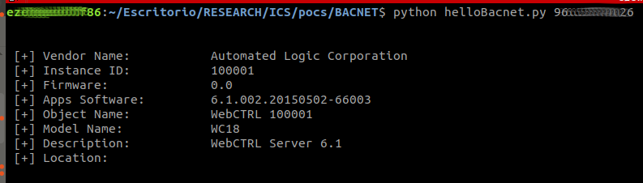
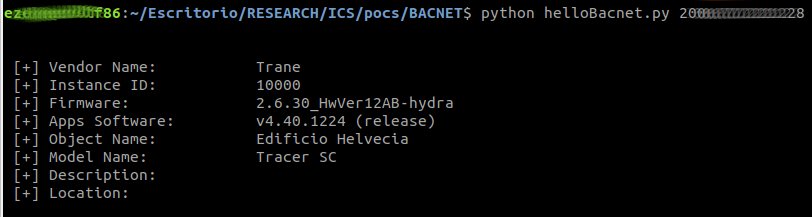
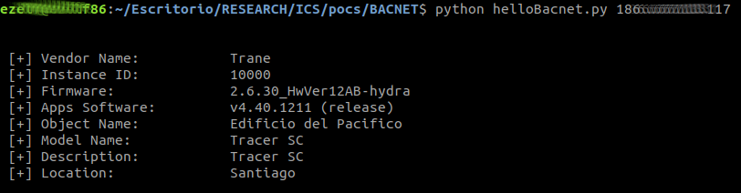

### MODBUS/TCP

Functions codes definition
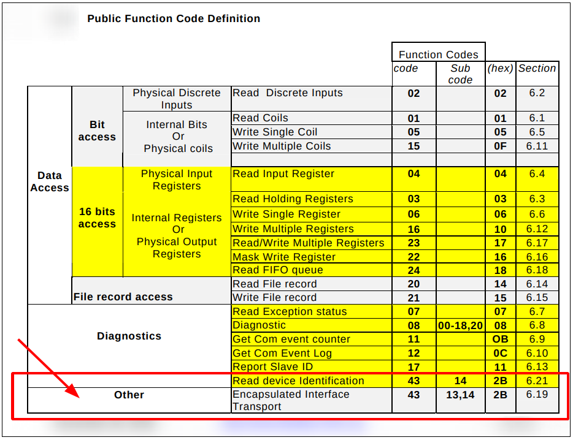

TOOL, Usage: 

    usr@pwn:~$ modbus_fnc43.py <modbus host>

### POCS
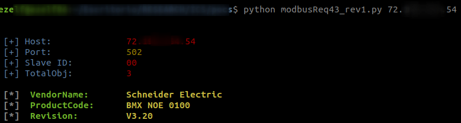
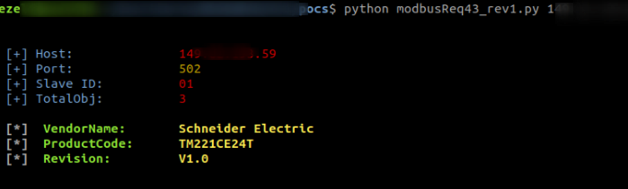
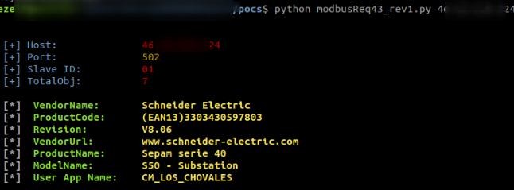
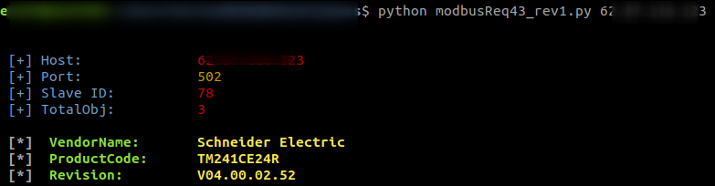

Nota: Modbus es posible encontrarlo en puertos distintos al 502
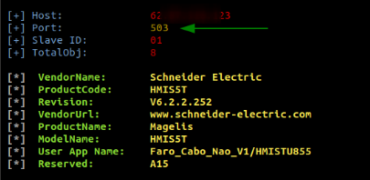

Nota2: Modbus no es esclusivo de dispositivos de la firma Schneider Electric
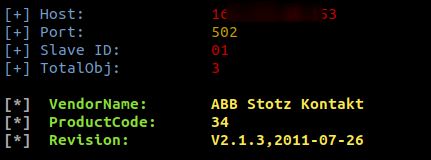

### CRIMSON
	...
### s7
	...	

