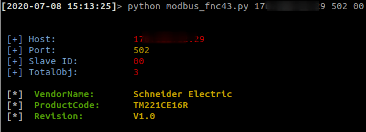
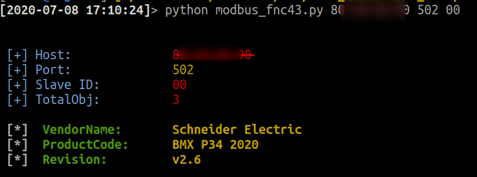
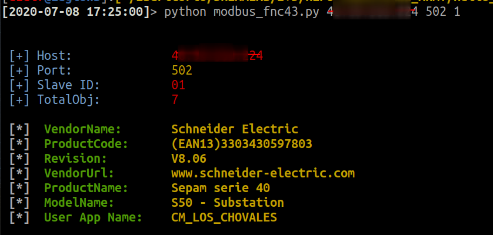
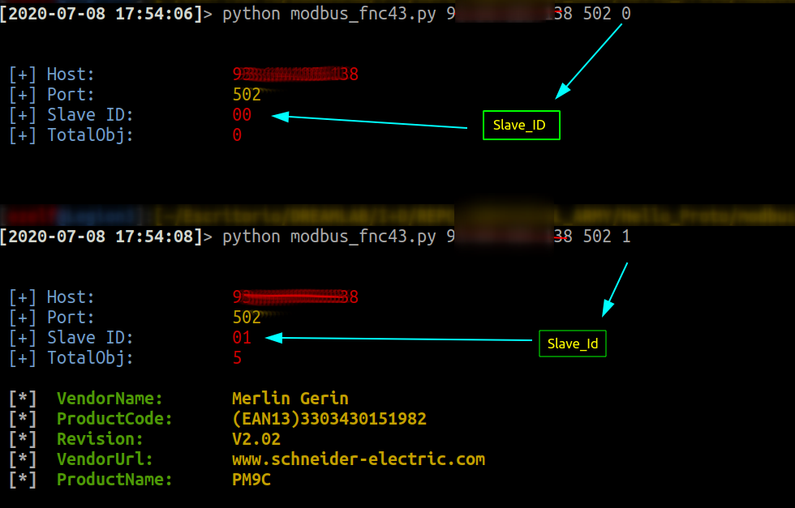
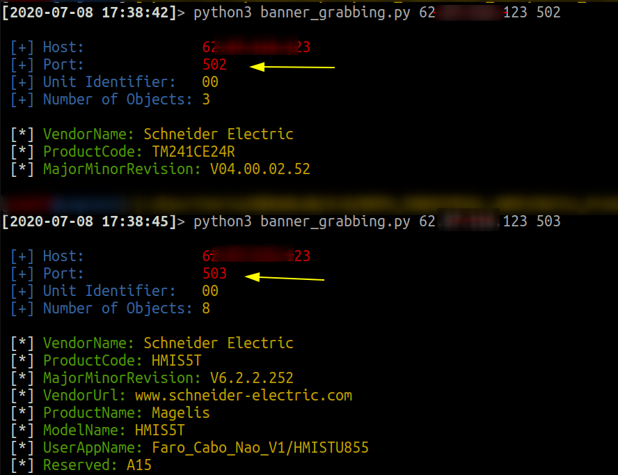
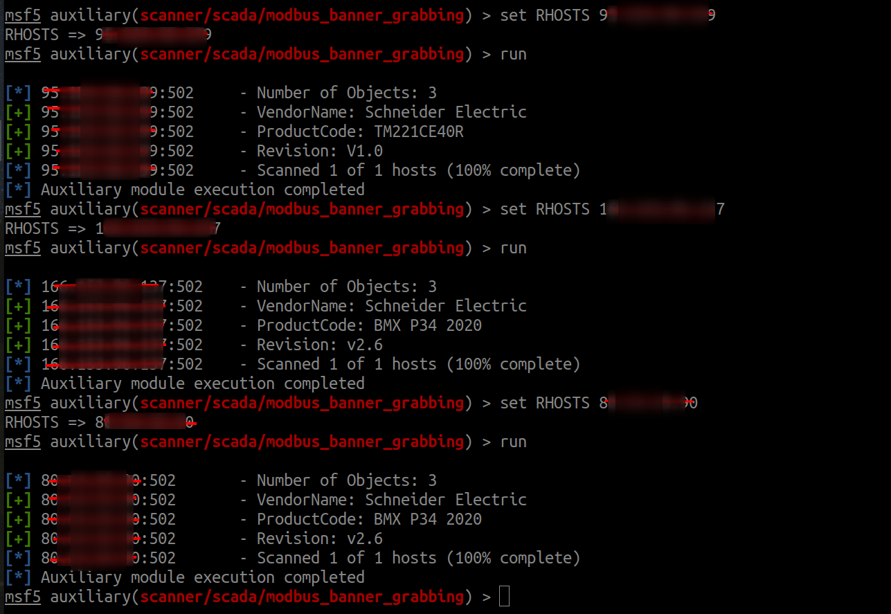
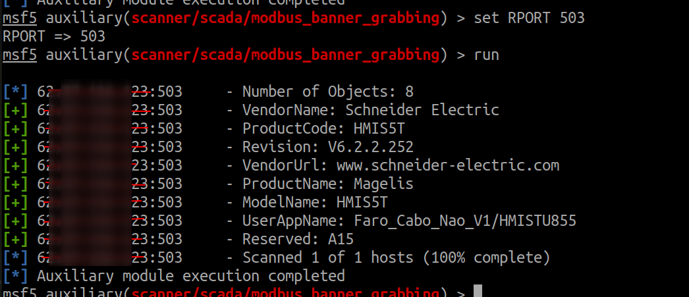

# MODBUS BANNER
Modbus: "Banner Grabbing"

### MODBUS/TCP

Functions codes definition


# Scripts 
### $ modbus_fnc43.py
**Install:** 

`pip3 install -r requirements.txt`

**usage:**	

`usr@pwn:~$ python3 banner_grabbing.py <modbus_host>`  

```
optional arguments:
  -h, --help  show this help message and exit
  -port PORT  Destination port
  -slaveid SLAVEID  SlaveID
```

## poc	






# Metasploit module
## usage: modbus_banner_grabbing.rb

	msf5 > use auxiliary/scanner/scada/modbus_banner_grabbing
	msf5 auxiliary(scanner/scada/modbus_banner_grabbing) > set RHOSTS 95.124.58.199
	RHOSTS => 192.168.0.22
	msf5 auxiliary(scanner/scada/modbus_banner_grabbing) > run
	
## PoC




